# TechTalk: E2E Observability on Multi-Agent Systems using the Microsoft Agent Framework & OTEL

Session delivered on the 11th of February at Tech Connect 2026

## 🎯 Session Goals

- Master the Microsoft Agent Framework (MAF) to build and publish Agents v2 on Foundry
- Learn multi-agent orchestration with sequential workflows and OpenTelemetry instrumentation
- Apply production-ready observability patterns for both developers and Business Decision Makers

## 📋 Session Abstract

This session explores end-to-end observability for multi-agent systems using Microsoft Foundry and the Microsoft Agent Framework (MAF). Through a real-world fraud detection scenario, attendees will build three specialized agents, instrument them with OpenTelemetry, and create dashboards that serve both technical teams and business stakeholders. The workshop demonstrates how observability data flows from distributed traces to executive Power BI dashboards—ensuring AI systems remain transparent, auditable, and trustworthy.

## 🎯 Key Audience Takeaways

- Build and orchestrate Foundry Agents v2 using the Microsoft Agent Framework
- Implement the 3-tier observability framework: spans, business metrics, and custom events
- Create Application Insights workbooks and Power BI dashboards for real-time monitoring
- Deploy containerized agents with tracing that works identically in local and production environments

## Repository Flow

### From Zero to Hero – Observability for Multi-Agent Development

👉 **[From Zero to Hero](./from-zero-to-hero/README.md)**

**Building Foundry Agents with Microsoft Agent Framework**

Using latest MAF to build and publish new Agents v2 on Microsoft Foundry.

**Multi-Agent orchestration and local playground**

Orchestrate you agents and test them using Local Playground from the Microsoft Foundry VS Code extension.

**Hosted agents and observability on Multi-Agent Systems with OpenTelemetry**

Learn how to deploy local multi-agent orchestration to become a hosted agent in Microsoft Foundry. Enable built-in observability through OpenTelemetry.

### Production-Ready Observability of your System for Developers and BDMs 

👉 **[Production-Ready Observability](./production-ready-observability/README.md)**

#### What we are building:

```mermaid
flowchart LR
    subgraph Input
        TX[/"Transaction Request"/]
    end
    
    subgraph Agents["Fraud Detection Workflow"]
        A1[("CustomerDataAgent<br/>―――――――――<br/>Cosmos DB")]
        A2[("RiskAnalyserAgent<br/>―――――――――<br/>AI Search")]
        A3[("FraudAlertAgent<br/>―――――――――<br/>Decision Engine")]
    end
    
    subgraph Output
        D1[/"✓ Approved"/]
        D2[/"⚠ Investigate"/]
        D3[/"✗ Blocked"/]
    end
    
    subgraph Observability["Telemetry Pipeline"]
        T1["Spans & Traces"]
        T2["Business Metrics"]
        T3["Custom Events"]
    end
    
    TX --> A1
    A1 -->|"Customer Profile<br/>+ History"| A2
    A2 -->|"Risk Score<br/>+ Factors"| A3
    A3 --> D1
    A3 --> D2
    A3 --> D3
    
    A1 -.-> T1
    A2 -.-> T2
    A3 -.-> T3
    
    T1 --> AI["Application Insights"]
    T2 --> AI
    T3 --> AI
    
    AI --> WB["Workbooks"]
    AI --> PBI["Power BI"]
```

#### How are we building?

| Part | Focus | Duration | Description |
|------|-------|----------|-------------|
| **Part 1** | Infrastructure Deployment | ~15 min | Deploy Azure resources (AI Services, Cosmos DB, AI Search, App Insights) and seed sample data for the fraud detection scenario |
| **Part 2** | Create the Tracing Engine | ~30 min | Understanding spans and custom metrics creation. Run individual agents, orchestrate workflows, and generate telemetry with OpenTelemetry using the 3-tier tracking framework |
| **Part 3** | Visualize Traces and Logs | ~25 min | Leveraging Azure Application Insights workbooks, Grafana dashboards, and building Power BI dashboards to ship real-time KPIs to Business Decision Makers |
| **Part 4** | Deploy to Production | ~10 min | How tracing works seamlessly in containers—same code, same traces, whether running locally or in Azure Container Apps |

### Additional resources

Learn how we are skilling-up our customers with these additional resources from hackathons and workshops:

- 👉 **[Claims Processing with Microsoft Foundry Agents Hackathon](https://github.com/microsoft/claims-processing-hack)**
- 👉 **[Intelligent Predictive Maintenance Hackathon](https://github.com/microsoft/agentic-factory-hack)**
- 👉 **[Automated Regulatory Compliance & Audit​ Hackathon](https://github.com/microsoft/azure-trust-agents)**

## 🚀 Getting Started

1. **Prerequisites:**
   - Azure subscription
   - IDEs: there is a `devcontainer` available for this repo. You can either use:
     - GitHub Codespaces
     - VS Code with Dev Containers extension
   - Python 3.12+

2. **Choose Your Path:**
   - **Building Agents?** → Start with [From Zero to Hero](./from-zero-to-hero/README.md)
   - **Implementing Observability?** → Go to [Production-Ready Observability](./production-ready-observability/README.md)

## 📧 Contact & Support

For questions or feedback, feel free to open an issue or reach out to the maintainers:

| Name | Email |
|------|-------|
| David Sancho Ruiz | dsanchoruiz@microsoft.com |
| Marta Santos | martasantos@microsoft.com |
| Renato Ribeiro | renribeiro@microsoft.com |
